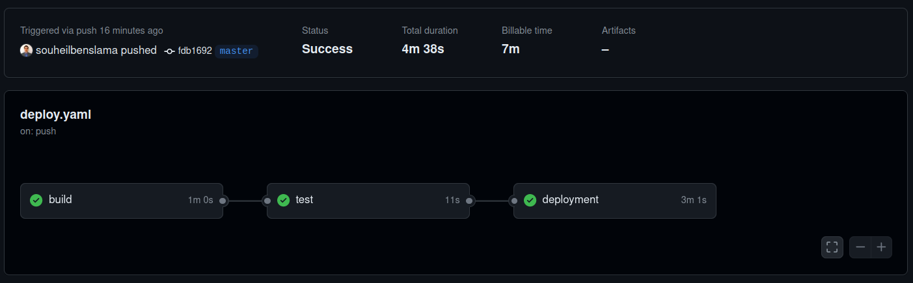

The hello world Flask application

The repository includes a Flask hello world application along with its Dockerfile for building Docker images. It also contains all the necessary manifests for deploying the application on a Kubernetes cluster, along with the Helm chart for the application.


this Readme file contains  the detailed instructions on how to deploy and test the application.


## Prerequisites Tools

To test and deploy this application, you will need the following tools:

- [Flask](https://flask.palletsprojects.com/en/3.0.x/installation/)
- [Docker](https://docs.docker.com/engine/install/)
- [Minikube](https://minikube.sigs.k8s.io/docs/start/)
- [Kubectl](https://kubernetes.io/docs/tasks/tools/install-kubectl-linux/)
- [Helm](https://helm.sh/docs/intro/install/)


## Local Testing

To start testing this application, you need to create a virtual environment, install the required dependencies in it, and then run the application.

```bash
python -m venv .venv
```
```bash
source ./.venv/bin/activate
```
now you need to install the requirements in the virtual env

```bash
pip install -r requirements.txt
```

You can then start the app by running:

```bash
flask run --host 0.0.0.0 
```

## Build Process

The application will be built using Docker. We will create a Docker image based on our Dockerfile, which contains the necessary steps to build our image.

To build the image, use the following command:

```bash
docker build -t your-registry/image-name:tag .
```

To push this image, you need to login to your registry using:

```bash
docker login
```

Then, push your image using:

```bash
docker push your-registry/image-name:tag
```
Replace your-registry, image-name, and tag with your actual registry, image name, and tag respectively.


# Deployment

To deploy our application on a Kubernetes cluster, we will use Minikube to create a local Kubernetes cluster on our machine. We will start our cluster using the following command:

```bash
 minikube start --network-plugin=cni
 ```

You can test your cluster's status by running: 

 ```
 minikube status
 ```
 

Next, we will deploy our application on the cluster by applying the different YAML files located in the manifests folder.

We can start by creating a namespace for our application using either of the following commands: 

```bash
kubectl create namespace "namespace_name"
```
or 
``` bash
kubectl apply -f manifests/namespace.yaml
```
Then, we deploy the application by creating the deployment resource for our app:
```bash
kubectl apply -f manifests/deployment.yaml 
```

You can check the status of your deployment using:


as we can see 3 of 3 replicas of our app are ready


Finally, we can deploy the rest of our resources (service, ingress, horizontal pod autoscaler, and network policy) by applying the corresponding manifests.
.

To enable Horizontal Pod Autoscaling (HPA) and benefit from it, you need to enable the Metrics Server on your Kubernetes cluster. 

For a running ingress make sure to have a running Ingress controller either by enabling it on Minikube or installing it manually.

For Minikube, you can enable the Metrics Server and Ingress Controller using the following commands:

First, enable the Ingress Controller:

```bash
minikube addons enable ingress
```

```bash
minikube addons enable metrics server
```

## Helm Chart Deployment

Another way to deploy our application and its required resources is by using the Helm chart located in the hello-world folder. A Helm chart is a way of packaging our Kubernetes application, and we will use Helm to install it with the following command:

```bash
helm install helloworld ./hello-world
```


# CI/CD Pipeline

For our CI/CD pipeline, we used GitHub Actions to define our pipeline. We have three stages in our pipeline: a build stage, a test stage, and a deployment stage. The pipeline definition is located in the .github/workflows/deploy.yaml file.


Since we have no access to a Kubernetes cluster on a cloud provider in our deployment stage, we decided to test the deployment using Minikube. We create a Minikube cluster and deploy our app using the Helm chart. Then, we test if the deployment succeeded.

# how we assured sefl-healing in this app ?
